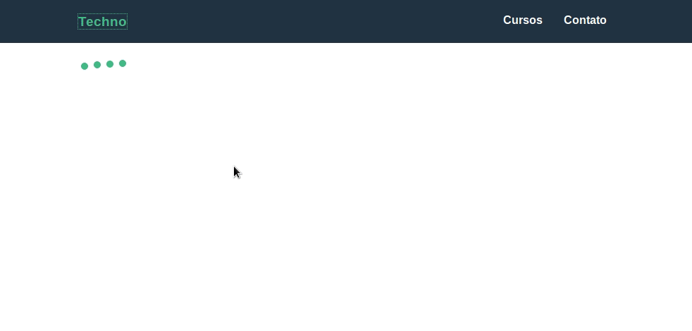

# Techno-Cursos

---



> Este projeto foi realizado em acompanhamento ao curso ministrado dentro da plataforma Origamid, cujo seu idealizador é [André Rafael](https://www.origamid.com/).

## Descrição

> O objetivo principal de aprendizagem com este projeto foi criar uma single page application utilizando o framework Vue.js fazendo proveito de alguns dos principais conceitos e ferramentas disponiveis dentro deste, tal como realizar o consumo de uma API simulada com o Json-server que, no entanto, apresenta endpoints da mesma forma que seria realizado em uma aplicação real.

## Caracteristicas

- Acesso a diferentes rotas
- Sub-rotas integradas
- Renderização condicional
- Uso de mixins
- Loading ao carregar dados

## Tecnologias

- Vue.js
- vue-router
- CSS3
- Json-server

## Como testar

```
npm install
```

```
npx json-server api/api.json
```

```
npm run server
```
